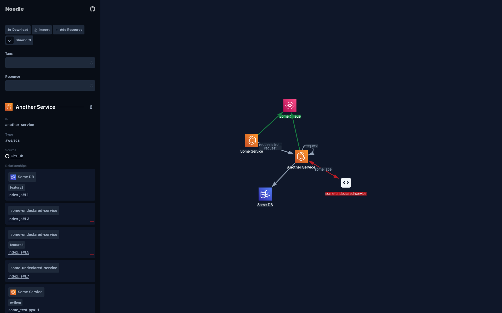

# Noodle 🍜 (UNDER CONSTRUCTION 🏗️)

[](https://github.com/noodle-graph/monorepo/actions/workflows/node.js.yml)

Architecture diagram that maintains itself.



---

- [Quick start](#quick-start)
- [Contributing](#contributing)

## Quick start

### 1. Install

```bash
npm install --location=global @noodle-graph/cli
```

### 2. Add [Noodle comments](./packages/scanner/README.md#noodle-comment)

[Simple example](./examples/basic/someService/index.js)

### 3. Create [config file](./packages/cli/README.md#scan-config-file)

[Simple example](./examples/basic/noodle.json)

### 4. `noodle run --open`

See more in the [CLI package](./packages/cli).

## Contributing

See [CONTRIBUTING.md](./CONTRIBUTING.md)
