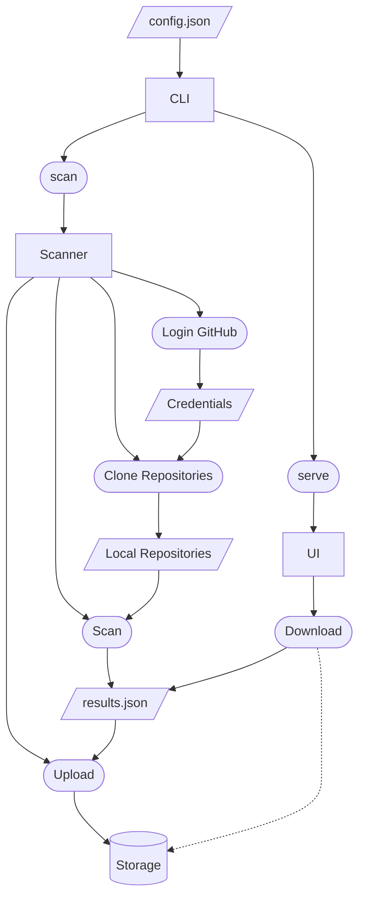

# Ecosystem

## Components

* [cli](../packages/cli)
* [scanner](../packages/scanner)
* [ui](../packages/ui)

```mermaid
graph TD

config.json[/config.json/]
Storage[("Storage")]
Repos[/Local Repositories/]
results.json[/results.json/]
Credentials[/Credentials/]
Login([Login GitHub])
Clone([Clone Repositories])
Scan([Scan])
Upload([Upload])
Download([Download])
serve([serve])
scan([scan])

CLI --> serve --> UI
config.json --> CLI --> scan --> Scanner
Scanner --> Login --> Credentials
Scanner & Credentials --> Clone --> Repos
Scanner & Repos --> Scan --> results.json
Scanner & results.json --> Upload([Upload]) --> Storage
UI --> Download --> results.json
Download -.-> Storage
```
